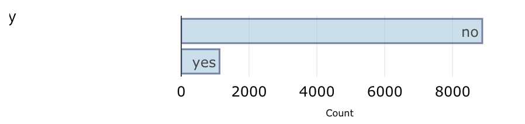
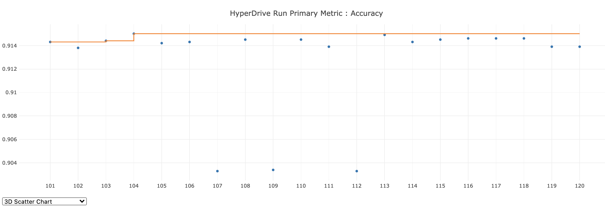
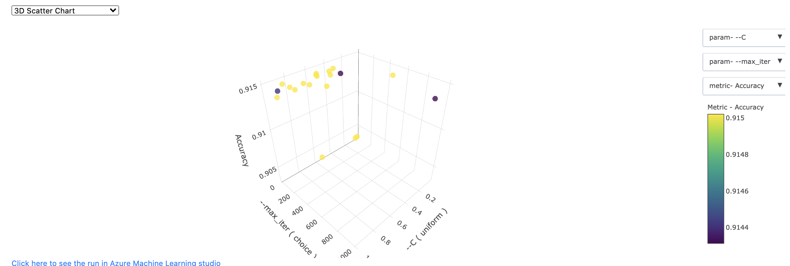

# Optimizing an ML Pipeline in Azure

## Overview
This project is part of the Udacity Azure ML Nanodegree.
In this project, we build and optimize an Azure ML pipeline using the Python SDK and a provided Scikit-learn model.
This model is then compared to an Azure AutoML run.

## Summary

This data set appears to contain bank data related to defaults on loans granted by a bank to consumers. While we don't know for sure, because for this project we were not given information about the data set, it appears that there is demographic information for individuals, such as age, occupation, marital status, etc, along with some basic economic information. There is then a target value of 0 or 1, which we believe may be whether the individual ended up defaulting on the loan.

One potential issue with this data set is it is somewhat imbalanced -- 88.72% of the 10,000 data points did _not_ default on their loans. So, this should give us pause when selecting our metric, because Accuracy may not be the best metric for an imbalanced data set. 



Of note, we did try to use other metrics, such as AUC, but were getting a number of errors indicating the metrics were not available (is this a subscription problem?), so we opted for Accuracy for this particular study.

```
127925/experiments/**SCRUBBED**/runs/HD_c0c85e98-cc17-4f22-8097-d1d07946f4b1_2, https://southcentralus.experiments.azureml.net/subscriptions/422c78cb-7b9f-41e7-a94c-e144f7afde5e/resourceGroups/aml-quickstarts-127925/providers/Microsoft.MachineLearningServices/workspaces/quick-starts-ws-127925/experiments/**SCRUBBED**/runs/HD_c0c85e98-cc17-4f22-8097-d1d07946f4b1_3] do not contain any metrics with the primary metric name at this moment, policy cannot be applied.
```

## Best Model
**In 1-2 sentences, explain the solution: e.g. "The best performing model was a ..."**

The best performing model was a TODO...

## Scikit-learn Pipeline

The first part of this project was to use the the Python SDK and a provided Scikit-Learn model.  

The model was a logistic regression model, for which we tuned the inverse regularization strength parameter `C` and the number of iterations `max_iter` to converge (LogisticRegression coverges uses gradient descent).  

We built a [HyperDrive](https://docs.microsoft.com/en-us/python/api/azureml-train-core/azureml.train.hyperdrive?view=azure-ml-py) pipeline using the Python SDK. 

The primary metric we were looking to maximize was Accuracy (again, we tried AUC but were getting the error noted above). We did hyperparameter sampling as noted below, and used a Bandit policy for early stopping, also as noted below. 

For the data, we used the sklearn `train_test_split` method to split the data into 70% training data and 30% testing data. 

### Hyperparameter Tuning

Using HyperDrive, we performed hyperparameter tuning on the inverse regularization strength `C` and maximum iterations `max_iter` parameters. We chose the `RandomParameterSampling` method rather than a full grid search because in practice the random method works almost as well, for much less compute time. 

For `C`, we opted for a random selection on the uniform distribution between 0 and 1. Since this is a continuous parameter, this felt like a proper distribution to choose. For the `max_iter` parameters, we specified a number of discrete choices, with a minimum of 10 and a maximum of 1000, as shown below.

```python
RandomParameterSampling({
    '--C': uniform(0, 1.0), 
    '--max_iter': choice(10, 25, 50, 75, 100, 150, 
                         250, 500, 1000)})
```

### Early Stopping Policy

We opted for the BanditPolicy, which was described to us in class. This is an early termination policy that terminates any runs where the metric is not performing well compared to the best-performing run. The benefit of this policy is that especially for long-running trials it will terminate early if the accuracy metric is too far off the best run so far, and in that way it will speed up the overall compute. 

### Results

Our HyperDrive model displayed a shockingly low amount of variation for the various hyperparameter choices, as shown in the figures below. The `C` parameter appeared to make very little difference, and increasing the number of iterations does not appear to help either.





Below are the metrics from our "best" model; again, however, the overall difference between models was very small at best.

TODO -- METRICS HERE

## AutoML
**In 1-2 sentences, describe the model and hyperparameters generated by AutoML.**

### Results


## Pipeline comparison
**Compare the two models and their performance. What are the differences in accuracy? In architecture? If there was a difference, why do you think there was one?**

## Future work

There are some ways we might improve the models. This includes: 

* Optimizing for a different metric. Using AUC or Precision (aka True Positive Rate), might be a better choice, especially for this imbalanced data set.  
* Perhaps clean the data a bit more thoroughly.  
* Try to use a balanced data set rather than imbalanced one.  
* With the selected best model, do hyperparameter tuning if we can using HyperDrive.  

## Proof of cluster clean up
**If you did not delete your compute cluster in the code, please complete this section. Otherwise, delete this section.**
**Image of cluster marked for deletion**
