# Using AzureML to Predict Malware Infections

This repo is my project submission for the Capstone of the [Udacity Azure Machine Learning Engineer Nanodegree](https://www.udacity.com/course/machine-learning-engineer-for-microsoft-azure-nanodegree--nd00333).

## Project Overview

For this project, I used a data set from the 2019 [Microsoft Malware Prediction](https://www.kaggle.com/c/microsoft-malware-prediction) Kaggle competition. Due to the large size of the data set, I used a truncated version of the data (only about 0.1% of the original data) so that I could complete all the tasks in a reasonable amount of time. More information about the data set is below in the *Dataset* section. 

I opted to treat this as a *classification* task, using *accuracy* as the metric.

For this project, I ran essentially two processes:

1. First I set up an Azure [AutoML](https://docs.microsoft.com/en-us/azure/machine-learning/concept-automated-ml) experiment using the Python SDK. With this AutoML run, I attempted to find the best model -- that is, the model with the highest accuracy in predicting malware infections on my data set (using cross-validation).    
2. Next I ran an Azure [HyperDrive](https://docs.microsoft.com/en-us/azure/machine-learning/how-to-tune-hyperparameters) experiment, using XGBoost as my algorithm of choice, to tune three different hyperparameters and find the best-performing model (again using cross-validation).  

After determining my best model (spoiler alert: the AutoML VotingEnsemble model), I deployed it as an webservice/endpoint, tested consumption of the model using addtional data, and finally shut down the webservice.


## Project Set Up and Installation

In order to run this project yourself, you will need to:

  * Sign into [Microsoft Azure Machine Learning](https://ml.azure.com/).  
  * Set up a Compute Instance. *Note*: the Udacity Labs automatically set this up for us, with the following VM size: `STANDARD_DS3_V2 (4 Cores, 14 GB RAM, 28 GB Disk)`, and `CPU`.  
  * From the "Notebooks" tab, upload the following files from this repo:  
    * automl.ipynb  
    * automl_scoring.py  
    * hyperparameter_tuning.ipynb  
    * xgbtrain.py  
  * Make sure you have access to the data I have truncated and provided at: 
    * train data:  https://raw.githubusercontent.com/tybyers/AZMLND_projects/capstone/capstone/data/train_1_10k.csv  
    * test data: https://raw.githubusercontent.com/tybyers/AZMLND_projects/capstone/capstone/data/test_data.json 

## Dataset

### Overview

This data set was taken from the [Microsoft Malware Prediction](https://www.kaggle.com/c/microsoft-malware-prediction) competition run in 2019. "Microsoft is challenging the data science community to develop techniques to predict if a machine will soon be hit with malware. As with their previous, Malware Challenge (2015), Microsoft is providing Kagglers with an unprecedented malware dataset to encourage open-source progress on effective techniques for predicting malware occurrences."  

The raw training data set for the competition is very large: 8,921,483 observations (rows), and 83 features (variables), taking up 4.1 GB of space! 

In order to allow us to complete the tasks for this assignment in a reasonable amount of time, I took a very small subset of the entire train.csv data set -- just 10,000 rows (or about 0.1% of the entire training set). I skimmed off the top 10,000 rows from the data set for use in this project, and put it on my GitHub at https://raw.githubusercontent.com/tybyers/AZMLND_projects/capstone/capstone/data/train_1_10k.csv.  

### Task

The goal for this project is to predict whether a Windows machine is infected by various families of malware, based on different properties of that machine. Each row in this dataset corresponds to a machine, and has observations from telemetry data generated by WindowsDefender. The `HasDetections` column indicates that Malware was detected on the machine. 

For my 10,000 row data set, 4,950 machines have no malware detections, and 5,050 machines have malware detections. This is a nice, balanced data set, and basically the "baseline" accuracy for malware detection is 50.5% (that is, if my Machine Learner gets better than 50.5% accuracy, then it's better accuracy than if I called everything "infected").

### Access

I have uploaded the modified/truncated data to this GitHub repo and am accessing it in the following manner, using the Azure Python SDK:


```python
# Load Training Data set
data_path = 'https://raw.githubusercontent.com/tybyers/AZMLND_projects/capstone/capstone/data/train_1_10k.csv'
dataset = tdf.from_delimited_files(path=data_path)
dataset.to_pandas_dataframe().head()
```

```python
# Load Test Data Set
import requests
test_data_path = 'https://raw.githubusercontent.com/tybyers/AZMLND_projects/capstone/capstone/data/test_data.json'

r = requests.get(test_data_path)
input_data = r.text
```

## Automated ML

The first experiment was an AutoML experiment. my settings and configuration for the experiment looked as thus:

```python
automl_settings = {
    "experiment_timeout_minutes": 30,
    "max_concurrent_iterations": 5,
    "primary_metric" : 'accuracy'
}

# TODO: Put ymy automl config here
automl_config = AutoMLConfig(
    compute_target=cpu_cluster,
    task="classification",
    training_data=dataset,
    label_column_name='HasDetections',
    enable_early_stopping=True,
    path=project_folder,
    debug_log='automl_errors.log',
    n_cross_validations=5,
    **automl_settings
)
```

Some of the config and settings were straightforward, but I chose other configurations for the following reasons:

  * `experiment_timeout_minutes = 30` -- Opted for 30 minutes so my Udacity-provided labs wouldn't time out, and this seemed to be sufficient to get through the training. Based on the RunDetails widget it appears a couple jobs were canceled, but since the overall results were pretty stable I judge this wasn't a large factor.
  * `max_concurrent_iterations = 5` -- Runs some iterations in parallel to speed up processing.  
  * `primary_metric = 'accuracy'` -- I opted for accuracy here, although AUC would have been a good choice too. Mostly opted for this for simplicity to compare it to the Hyperdrive run.  
  * `task = 'classification'` -- Since we're classifying whether a machine is infected or not, this is a natural choice.  
  * `label_column_name = 'HasDetections'` - This is the "target" column.  
  * `enable_early_stopping = True` - No need to keep going if models are doing well enough.  
  * `n_cross_validations = 5` - Wanted to do some cross validation. Especially important with a small data set with high cardinality.  

### Results

The best model overall was the `VotingEnsemble` model, with an accuracy of 0.6378. The remainder of the models were between about .505 and 0.624, except `StackedEnsemble` at 0.6357.

Here is a screeenshot of the `RunDetails` widget from the Jupyter notebook:


If I look at the details of this model in the Azure ML Portal, I can see the AUC was 0.687 (which was also close to the winning AUC for the Kaggle competition using the larger version of this data set).

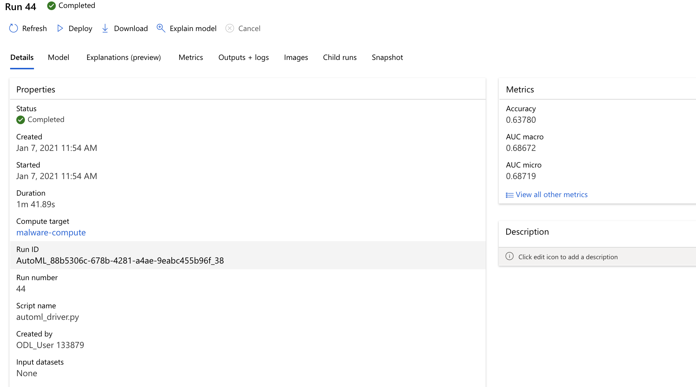

Next, I look the best model's Feature Importances, and I see only 5 features actually contributed meaningfully to the model. 

 

### Registering the Best Model

I then registered the best model. Below is a screenshot of the Azure ML Portal with the best model saved (note I also have the best HyperDrive model too). 

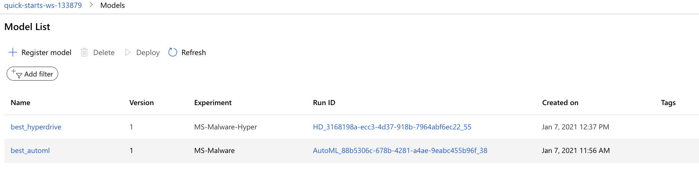

Note the Run ID from the highlighted line above, and compare to the Run ID from the Run details list in the previous section. 

Next, I compared this model to the HyperDrive-tuned model to see which one I should deploy. 

## Hyperparameter Tuning

For the Hyperparameter tuning experiment, done via HyperDrive, I opted for tuning an XGBoost model. I did this because, of the top 10 performing AutoML models, 4 of them were XGBoost Classifiers. I are unsure how much hyperparameter tuning, if any, happens with AutoML, so I wanted to see if I could do any better than the AutoML XGBoost.

### Details  

For the HyperDrive experiment, I had to write an entry script, which can be found in the "xgbtrain.py" file in this repo.  This script allows up to 5 parameters to be passed into it -- only 3 of which I actually used for tuning the hyperparameters.  I used the other 2 parameters for some "offline" training of the script while I was developing it. 

I opted to tune the following hyperparameters because, based on my experience using XGBoost in the past, these are some of the highest-leverage hyperparameters to tune:

```python
param_sampling = RandomParameterSampling(
    {'--max_depth': choice(range(2,11)),
    '--n_estimators': choice(25, 50, 100, 250, 500, 750, 1000),
    '--learning_rate': uniform(0, 1.0)})`
```
* `max_depth` - Maximum depth of a tree. Increasing this value will make the model more complex and more likely to overfit.
* `n_estimators` - Number of boosting rounds. Trains faster when smaller; too large can overfit.
* `learning_rate` - Step size shrinkage used in update to prevents overfitting. Range: [0, 1]

The remainder of my HyperDrive configuration is below, with an explanation following. 

```python
early_termination_policy = BanditPolicy(evaluation_interval=2, slack_factor=0.1)

src = ScriptRunConfig(source_directory=project_folder,
                      script='xgbtrain.py',
#                      arguments=['--kernel', 'linear', '--penalty', 1.0],
                      compute_target=cpu_cluster,
                      environment=hyperdrive_env)

hyperdrive_config = HyperDriveConfig(run_config=src,
                                    hyperparameter_sampling=param_sampling,
                                    policy=early_termination_policy,
                                    primary_metric_name='Accuracy',
                                    primary_metric_goal=PrimaryMetricGoal.MAXIMIZE,
                                    max_total_runs=100,
                                    max_concurrent_runs=4)
```

* `early_termination_policy = BanditPolicy` - This is an early termination policy that terminates any runs where the metric is not performing well compared to the best-performing run. The benefit of this policy is that especially for long-running trials it will terminate early if the accuracy metric is too far off the best run so far, and in that way it will speed up the overall compute.  
* `environment=hyperdrive_env` -- Explained below  
* `primary_metric_name='Accuracy'` -- Opted for Accuracy here to be consistent with the AutoML experiment.  
* `primary_metric_goal=PrimaryMetricGoal.MAXIMIZE` -- Obviously I want the highest accuracy and not the lowest :). 
* `max_total_runs=100` -- XGBoost can train fairly fast, so let's see if I get any real outstanding hits. Even so, limit to only 100 runs.  
* `max_concurrent_runs=4` -- Run up to 4 models in parallel.  

### Environment

I also had to create a custom conda environment to run the experiment. 

I did so using a Jupyter cell magic, which wrote a new file called "hyperdrive_dependencies.yml":

```python
%%writefile hyperdrive_dependencies.yml

dependencies:
- python=3.6.2
- scikit-learn
- pandas 
- numpy
- pip:
    - azureml-defaults
    - xgboost
```

Then I created a conda environment from this file:

```python
hyperdrive_env = Environment.from_conda_specification(name = 'hyperdrive-env', file_path = './hyperdrive_dependencies.yml')
```

### Results

Next, I ran the experiment! Note that this was a 5-fold cross-validation, just like for AutoML. 

The best model gave an accuracy of 0.626, and the worst model and accuracy of 0.5785.

The best model's parameters were: 
  * `max_depth`: 2  
  * `n_estimators`: 100  
  * `learning_rate`: ~0.19  

The worst model's parameters were:  
  * `max_depth`: 9  
  * `n_estimators`: 25  
  * `learning_rate`: ~0.93

In general, I noticed that a small `max_depth` (2 or 3), at least 100 estimators, and a low `learning_rate` helped achieve a better score. This is probably due to the high cardinality of this data set with a relatively small number of observations, so it would be easy to overfit.    

Below is are two screenshots of the RunDetails widget. As I can see, there wasn't a huge amount of variability in the results between the various models.   

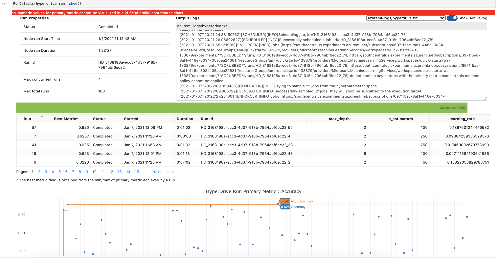

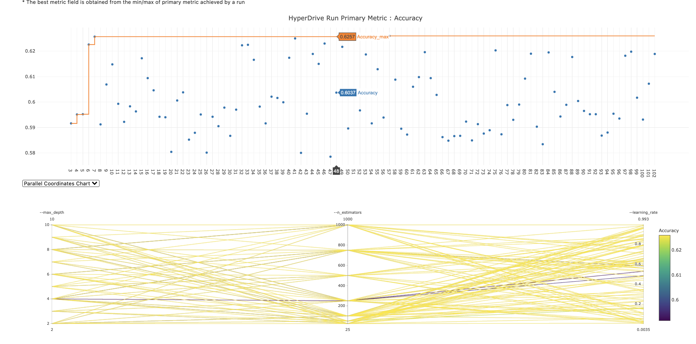

One fun note -- my best HyperDrive XGBoost model performed better than the best XGBoost AutoML model by an Accuracy of 0.002! (still worse than the VotingEnsemble, but better than the best XGBoost model!)

Looking in the Azure ML Portal, I can confirm what I are seeing within the Jupyter notebooks, regarding the best model and its hyperparameters: 

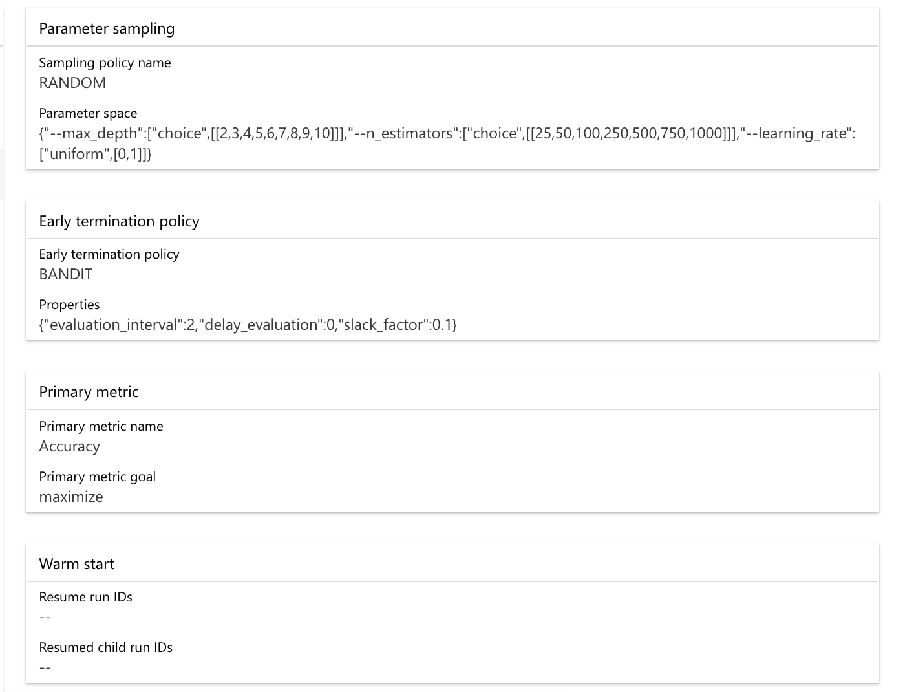

And finally another look at the details of the top model and the hyperparameters. 
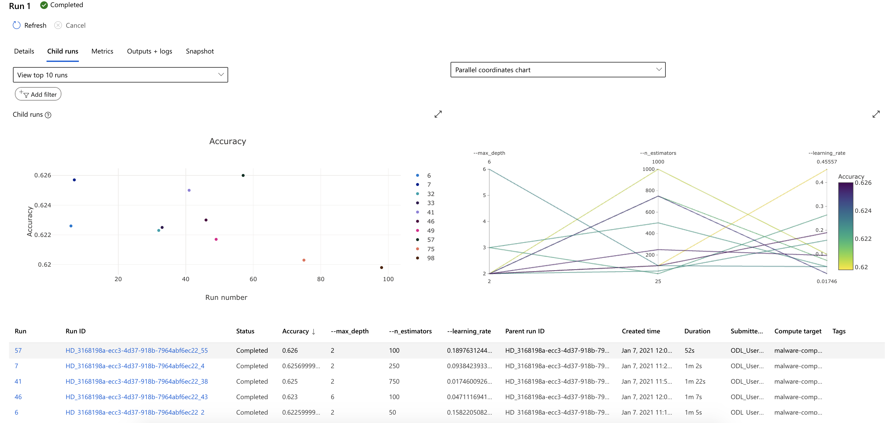 

### Registering the Best Model

Just like for the automl model, I also registered the best hyperdrive model. Below is a screenshot of the Azure ML Portal with the best model saved. 

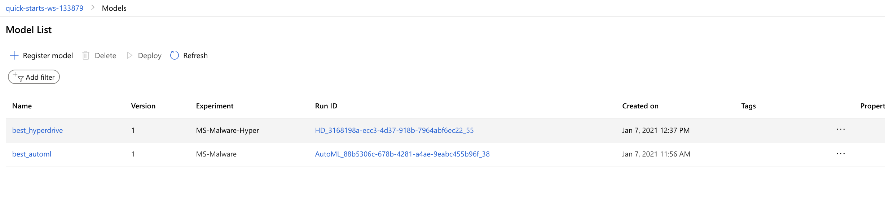

Note the Run ID from the highlighted line above, and compare to the Run ID from the Run details list in the previous section. 

Next, I compared this model to the HyperDrive-tuned model to see which one I should deploy. 

## Model Deployment

Finally, I deployed the best model -- which happened to be the `VotingEnsemble` model from the AutoML run, as an endpoint.  

The details for doing this are in the `automl.ipynb` Jupyter notebook (screenshot below), starting at the "Model Deployment" section. After registering my best model, I then created an Inference and Deployment config, and then deployed as a Web Service.

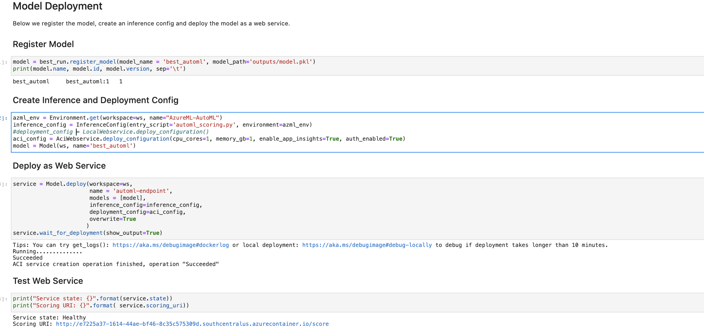

I can see below the endpoint as active in the Azure ML Portal:

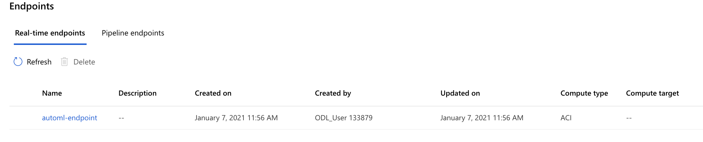

Clicking into the endpoint I see the details of the endpoint:

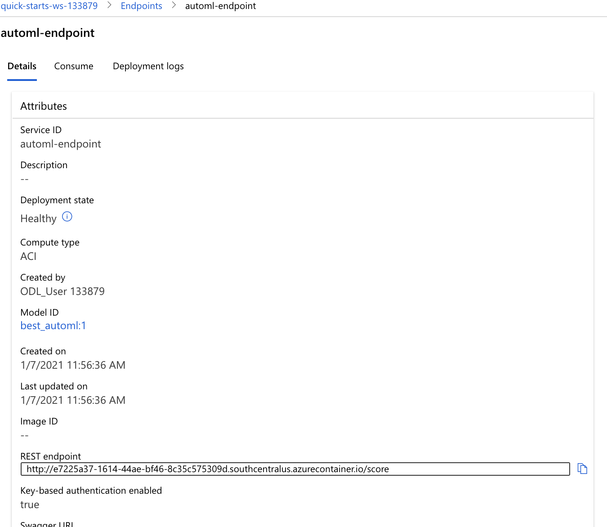

and information related to how to consume the endpoint:  

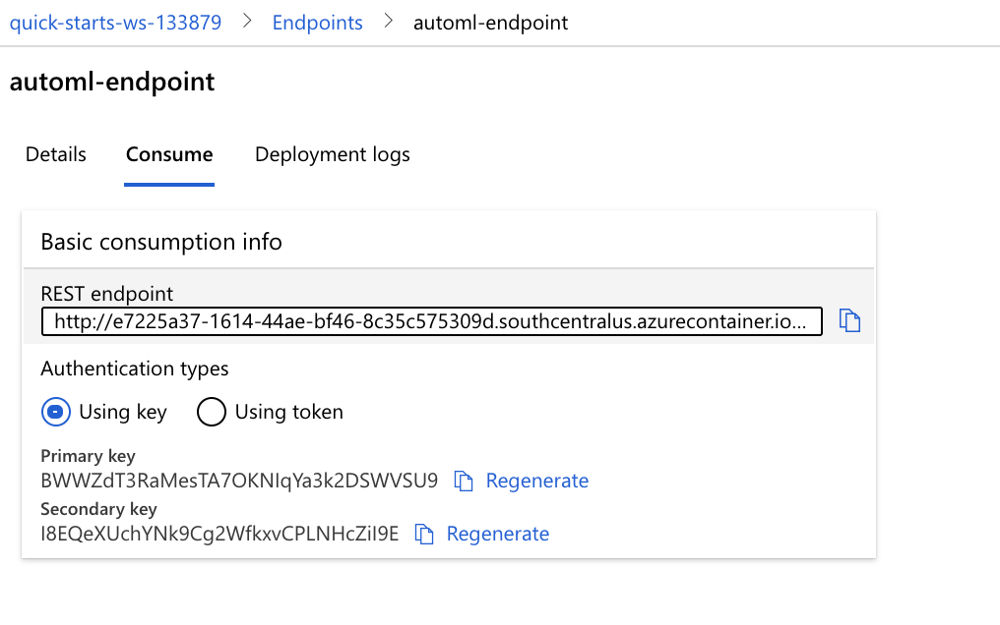  

### Testing Endpoint

I then tested the endpoint with 5 sample data points that I harvested from the original Kaggle data set (not part of the 10,000 rows I grabbed used to train the model).

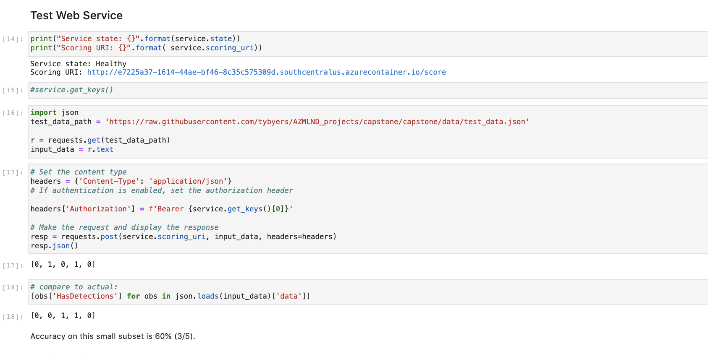 

The URL for that test data set is at: https://raw.githubusercontent.com/tybyers/AZMLND_projects/capstone/capstone/data/test_data.json.

The "automl_scoring.py" file in this repo is the file that I use to format the test data and send it to the web service.

My quick little test of 5 data points got 3/5 correct -- that is, 60% accuracy, or well in line with my expectations from my HyperDrive run.  

## Clean Up

I then shut down the webservice and computes I was using, from the automl.ipynb notebook:

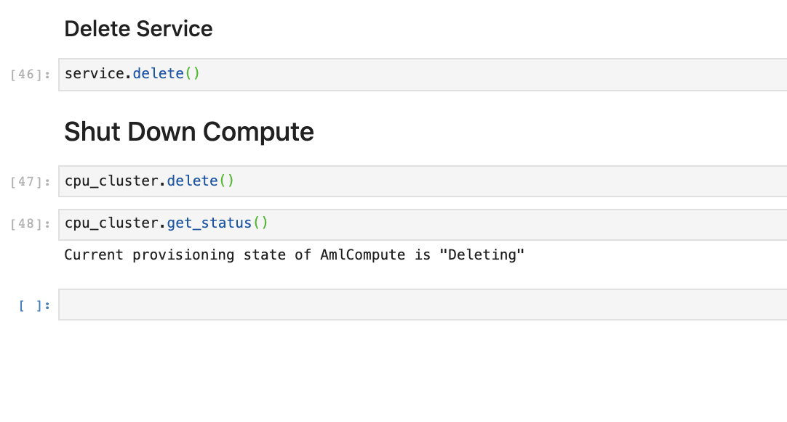 

As we can see, the compute cluster is in deleting status:

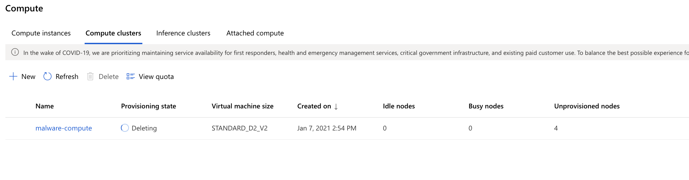 


And no endpoint remains:

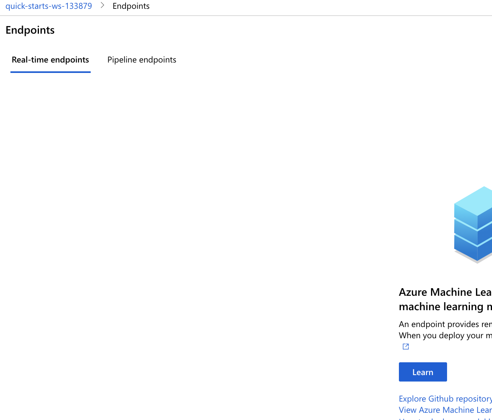


## Screen Recording

My 5-minute screencast walking through this project may be found at: https://youtu.be/paG6zcc5ogw

# Opportunities for Improvement

There are many ways I could improve this project.  

* Use the larger data set! I opted for a severly truncated data set from the original data to speed up training to fit within time limits for this project. Would be fun to train on the full data set!  
* Change metric to AUC. I chose Accuracy for easier intepretation for this project; however, the Kaggle competition itself was evaluated on AUC. Would be fun to see how the AUC for the entire data set compares to the winning Kaggle entries!  
* Do Deep Learning! It would be super interesting to try to do Deep Learning for the HyperDrive run. However, we'd likely need to use the larger data set to do it.  
* I deployed the "best model" from an accuracy perspective. In a real-world scenario, however, we may also wish to deploy a more "explainable" model, especially since I might need to determine *why* I believe a certain machine is infected with malware. Choosing a simpler, not ensemble, model, may give us the power to do so.  
* Perhaps I could have spent some time doing some feature engineering on the data set. I just used it "as is" without trying to do anything to improve the data before it was modeled.  
* Due to time commitments and other restraints, I did not do any of the "stand out" suggestions. I'd like to explore those things at a later date, however, especially if I begin using Azure ML for my job (a possibility!).  
