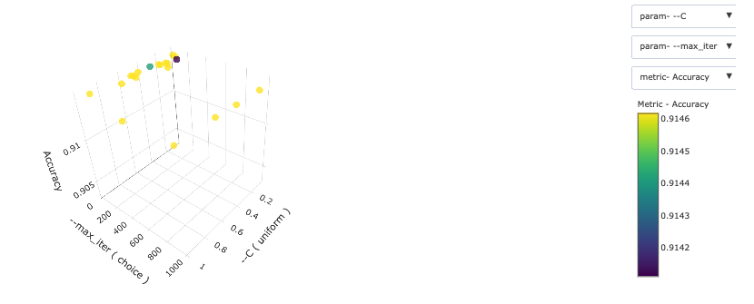
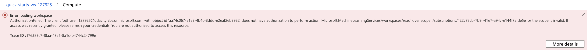

# Optimizing an ML Pipeline in Azure

## Overview

This repo is my project submission for Project #1 of the [Udacity Azure Machine Learning Engineer Nanodegree](https://www.udacity.com/course/machine-learning-engineer-for-microsoft-azure-nanodegree--nd00333). 

In this project, we build and optimize an Azure ML pipeline using the Python SDK and a provided Scikit-learn model. This model is then compared to an Azure AutoML run.

## Summary

This data set appears to contain bank data related to defaults on loans granted by a bank to consumers. While we don't know for sure, because for this project we were not given additional information about the data set, it appears that there is demographic information for individuals, such as age, occupation, marital status, etc, along with some basic economic information. There is then a target value of 0 or 1, which we believe may be whether the individual ended up defaulting on the loan.

One potential issue with this data set is it is somewhat imbalanced -- 88.72% of the 10,000 data points did _not_ default on their loans. So, this should give us pause when selecting our metric, because Accuracy may not be the best metric for an imbalanced data set. 


Of note, we did try to use other metrics, such as AUC, but were getting a number of errors indicating the metrics were not available (is this a subscription problem for our sponsored student subscription?), so we opted for Accuracy for this particular study.

```
127925/experiments/**SCRUBBED**/runs/HD_c0c85e98-cc17-4f22-8097-d1d07946f4b1_2, https://southcentralus.experiments.azureml.net/subscriptions/422c78cb-7b9f-41e7-a94c-e144f7afde5e/resourceGroups/aml-quickstarts-127925/providers/Microsoft.MachineLearningServices/workspaces/quick-starts-ws-127925/experiments/**SCRUBBED**/runs/HD_c0c85e98-cc17-4f22-8097-d1d07946f4b1_3] do not contain any metrics with the primary metric name at this moment, policy cannot be applied.
```

## Best Model

The best performing model was a [Voting Ensemble](https://docs.microsoft.com/en-us/python/api/azureml-train-automl-runtime/azureml.train.automl.runtime.ensemble.votingensemble?view=azure-ml-py) model in the AutoML experiment. It achieved an accuracy of 91.63%. This was only slightly better, however, than the LogisticRegression model with optimized hyperparameters using a HyperDrive experiment (91.46%). We don't believe that Accuracy was the most optimal metric to focus on (AUC would have been better), but as previously mentioned we were having difficulties using other metric types. 

## Scikit-learn Pipeline

The first part of this project was to use the the Python SDK and a provided Scikit-Learn model.  

The model was a logistic regression model, for which we tuned the inverse regularization strength parameter `C` and the number of iterations `max_iter` to converge (LogisticRegression coverges uses gradient descent).  

We built a [HyperDrive](https://docs.microsoft.com/en-us/python/api/azureml-train-core/azureml.train.hyperdrive?view=azure-ml-py) pipeline using the Python SDK. 

The primary metric we were looking to maximize was Accuracy (again, we tried AUC but were getting the error noted above). We did hyperparameter sampling as noted below, and used a Bandit policy for early stopping, also as noted below. 

For the data, we used the sklearn `train_test_split` method to split the data into 70% training data and 30% testing data. 

### Hyperparameter Tuning

Using HyperDrive, we performed hyperparameter tuning on the inverse regularization strength `C` and maximum iterations `max_iter` parameters. We chose the `RandomParameterSampling` method rather than a full grid search because in practice the random method works almost as well, for much less compute time. 

For `C`, we opted for a random selection on the uniform distribution between 0 and 1. Since this is a continuous parameter, this felt like a proper distribution to choose. For the `max_iter` parameters, we specified a number of discrete choices, with a minimum of 10 and a maximum of 1000, as shown below.

```python
RandomParameterSampling({
    '--C': uniform(0, 1.0), 
    '--max_iter': choice(10, 25, 50, 75, 100, 150, 
                         250, 500, 1000)})
```

### Early Stopping Policy

We opted for the BanditPolicy, which was described to us in class. This is an early termination policy that terminates any runs where the metric is not performing well compared to the best-performing run. The benefit of this policy is that especially for long-running trials it will terminate early if the accuracy metric is too far off the best run so far, and in that way it will speed up the overall compute. 

### Results

Our HyperDrive model displayed a shockingly low amount of variation for the various hyperparameter choices, as shown in the figures below. The `C` parameter appeared to make very little difference, and increasing the number of iterations does not appear to help either.




Below are the metrics from our "best" model; again, however, the overall difference between models was very small at best.

```python
{'Regularization Strength:': 0.9164214624777227,
 'Max iterations:': 50,
 'Accuracy': 0.9146181082448154}
 ```

## AutoML

We also ran an AutoML experiment to find the best algorithm to achieve the highest accuracy for this particular problem. The winning algorithm was the [Voting Ensemble](https://docs.microsoft.com/en-us/python/api/azureml-train-automl-runtime/azureml.train.automl.runtime.ensemble.votingensemble?view=azure-ml-py) algorithm, which implements soft voting of the previously run AutoML algorithms.

### Results

The results of the AutoML experiment are shown in the table below. The Voting Ensemble achieved the best accuracy, at 91.63%.

```
 ITERATION   PIPELINE                                       DURATION      METRIC      BEST
         0   MaxAbsScaler LightGBM                          0:00:58       0.9151    0.9151
         1   MaxAbsScaler XGBoostClassifier                 0:00:49       0.9149    0.9151
         2   MaxAbsScaler RandomForest                      0:00:47       0.8958    0.9151
         3   MaxAbsScaler RandomForest                      0:00:50       0.8880    0.9151
         4   MaxAbsScaler SGD                               0:00:44       0.8737    0.9151
         5   MaxAbsScaler SGD                               0:00:46       0.9047    0.9151
         6   MaxAbsScaler ExtremeRandomTrees                0:00:50       0.8998    0.9151
         7   MaxAbsScaler ExtremeRandomTrees                0:00:47       0.8995    0.9151
         8   MaxAbsScaler ExtremeRandomTrees                0:00:50       0.8998    0.9151
         9   MaxAbsScaler ExtremeRandomTrees                0:00:46       0.7747    0.9151
        10   MaxAbsScaler SGD                               0:00:46       0.9040    0.9151
        11   MaxAbsScaler SGD                               0:00:39       0.9030    0.9151
        12   MaxAbsScaler RandomForest                      0:00:40       0.8880    0.9151
        13   StandardScalerWrapper ExtremeRandomTrees       0:00:48       0.8880    0.9151
        14   MaxAbsScaler RandomForest                      0:00:46       0.7495    0.9151
        15   MaxAbsScaler SGD                               0:00:43       0.8537    0.9151
        16   MaxAbsScaler RandomForest                      0:00:46       0.8880    0.9151
        17   MaxAbsScaler ExtremeRandomTrees                0:00:45       0.8991    0.9151
        18   SparseNormalizer ExtremeRandomTrees            0:00:51       0.7266    0.9151
        19   MaxAbsScaler SGD                               0:00:42       0.9070    0.9151
        20   MaxAbsScaler ExtremeRandomTrees                0:00:49       0.7477    0.9151
        21   MaxAbsScaler RandomForest                      0:00:46       0.7766    0.9151
        22   VotingEnsemble                                 0:06:28       0.9163    0.9163
        23   StackEnsemble                                  0:06:29       0.9151    0.9163
Stopping criteria reached at iteration 24. Ending experiment.
```

#### Best Model Results

The full accuracy for the best model is below:

```python
{'accuracy': 0.9163277693474962}
```

The ROC curve for the predictions is shown below. An AUC of 0.98 means this is a very good model (though we should probably adjust the default threshold to achieve a better accuracy). 

. 

Finally, we look at the feature importance from the Voting Ensemble. The `duration` and `nr.employed` features were the most important here. 

 

## Pipeline comparison

Overall, there was very little difference in the performance of the two models. While for the HyperDrive we tried to optimize the hyperparameters for an otherwise very simple model, in AutoML we attempted to simply find the best algorithm. The AutoML achieved a very slightly better accuracy (0.1% better); however, Accuracy is not the metric we should have been focused on. Rather we should have focused on AUC for this imbalanced class data set. It's unfortunate that we were getting errors while trying to use other metrics. 

## Future work

There are some ways we might improve the models. This includes: 

* Optimizing for a different metric. Using AUC or Precision (aka True Positive Rate), might be a better choice, especially for this imbalanced data set.  
* Perhaps clean the data a bit more thoroughly.  
* Try to use a balanced data set rather than imbalanced one.  
* With the selected best model, do hyperparameter tuning if we can using HyperDrive.  
* The AUC of 0.98 from the ROC curve for the AutoML model indicates we should be able to achieve a better accuracy than the 91.6% that we did. We should do more work to adjust the default threshold value to achieve better accuracy. 

## Proof of cluster clean up

The images below show that I deleted my compute cluster and the entire workspace when I was finished. 


 

## Files

Additional files in this repo:

* [train.py](./train.py) -- The script for training the SKLearn Logistic Regression.  
* [udacity-project.ipynb](udacity-project.ipynb) -- Jupyter Notebook for running the HyperDrive and AutoML processes. 