# Azure ML Engineer Nanodegree Project 2

This repo is my project submission for Project #2 of the [Udacity Azure Machine Learning Engineer Nanodegree](https://www.udacity.com/course/machine-learning-engineer-for-microsoft-azure-nanodegree--nd00333).

In this project, we use Azure to configure a cloud-based machine learning production model, deploy it, and consume it. We also create, publish, and consume a pipeline. 

## Overview

For this project, we use the Banking dataset, which is the same data set we used for Project 1. This data set appears to contain bank data related to defaults on loans granted by a bank to consumers. While we don't know for sure, because for this project we were not given additional information about the data set, it appears that there is demographic information for individuals, such as age, occupation, marital status, etc, along with some basic economic information. There is then a target value of 0 or 1, which we believe may be whether the individual ended up defaulting on the loan.

One potential issue with this data set is it is somewhat imbalanced -- 88.72% of the 10,000 data points did not default on their loans. So, this should give us pause when selecting our metric, because Accuracy may not be the best metric for an imbalanced data set.

With this data set, for this project, we esentially conducted two related processes:  

1. The first process is to use Azure ML studio user interface to set up an AutoML run to find the best model to get the highest accuracy for the data. After the AutoML run completes, we deploy the best model as an endpoint. We then look at the Swagger documentation for this model, enable Application Insights (logging), and test out model consumption with a small JSON payload (note for project grader: testing out the model payload apparently produced the incorrect answer: [No, No] instead of [Yes, No]. This is interesting and we don't know the reason for this other than perhaps the model building process is non-deterministic and perhaps our best model was just slightly different than the typical model).  
2. The second part of this project was to use code and the Python SDK to publish a create and publish a pipeline. The pipeline itself used the same banking data set, conducted an AutoML experiment, and captured the best model. We then published and consumed that pipeline using the Python SDK. 

## Architectural Diagram

The following diagram visualizes the key steps of this project, which are then documented in more detail below.

## Key Steps

There were several steps to this project:

### Step 1: Authentication

I actually skipped this step, because I was using a Udacity-provided lab account, and the instructions said we did not have the permissions to do this step on the Udacity-provided labs.

### Step 2: Automated ML Experiment

For this step, I first made sure the proper data set was uploaded and registered in the 
ML Studio:

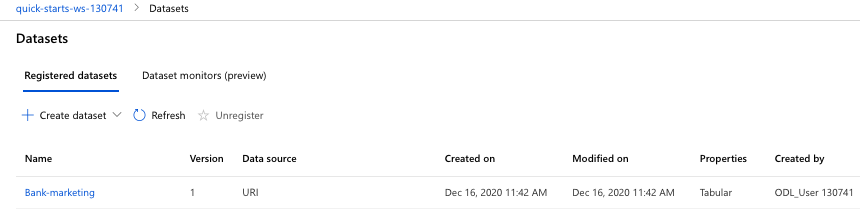

Then I created a new Automated ML run, which I titled "proj02". Then I set up a new compute cluster, called "proj02-compute". Next I ran the experiment!

The experiment successfully ran:

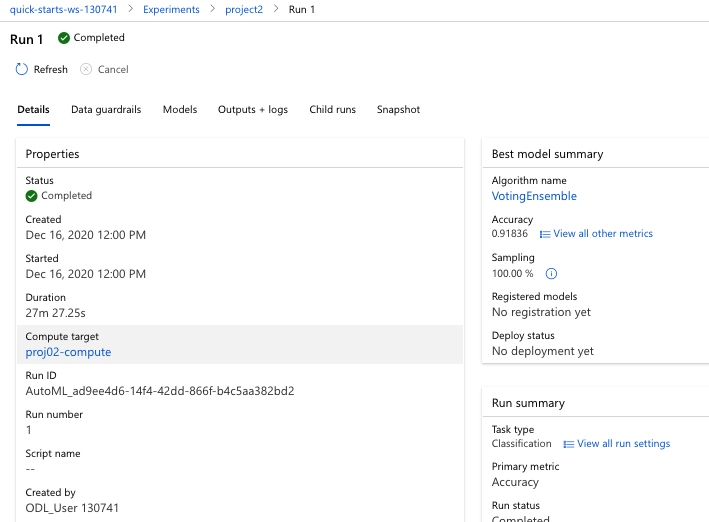  

The best model was a "VotingEnsemble" model, with an accuracy of 91.8%:

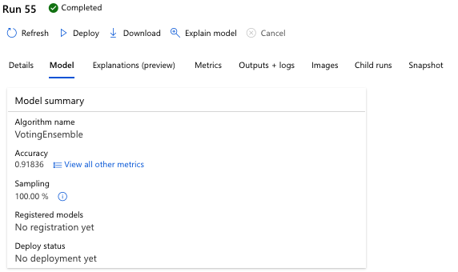

The ROC curves looked nice too!

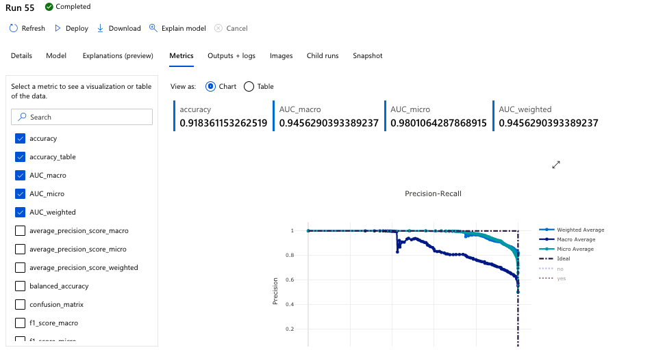

### Step 3: Deploy the Best Model

The next step was to select the best model and deploy it using Azure Container Instance. Here is a screenshot of the best model, which I named "best-model-voting-ensemble," deployed as an endpoint:

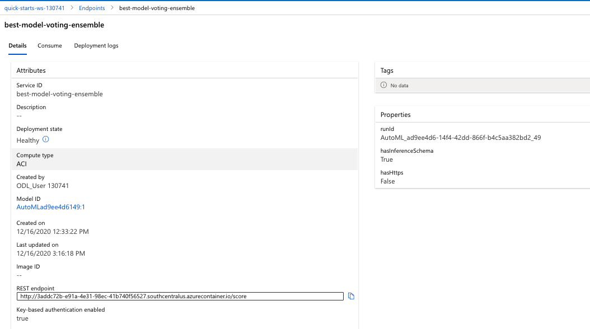

### Step 4: Enable Logging

Next we updated the `logs.py` code to enable application insights: 

We verify Application Insights was enabled: 

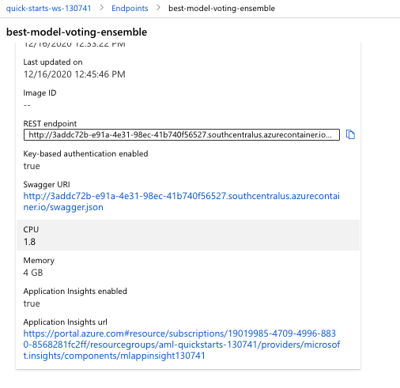 

And ran the `logs.py` code to get an output of the logs:

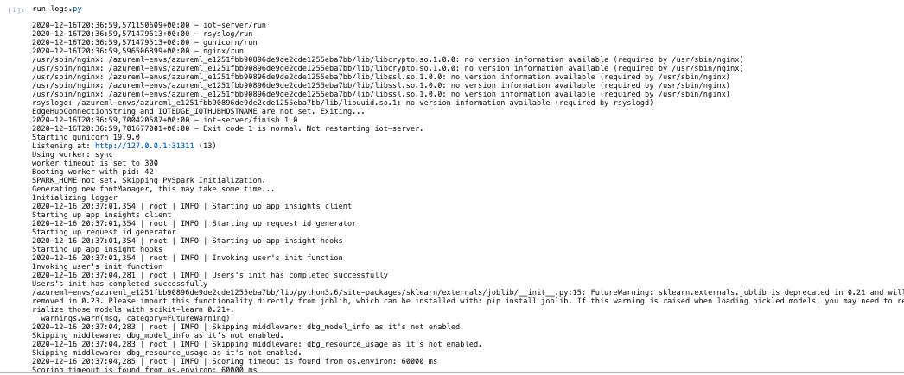 

### Step 5: Swagger Documentation  

Next, I downloaded the `swagger.json` file (available in this repo), ran the `swagger.sh` and `serve.py` code, and interacted with the Swagger documentation. Below are screenshots of the API methods and responses.

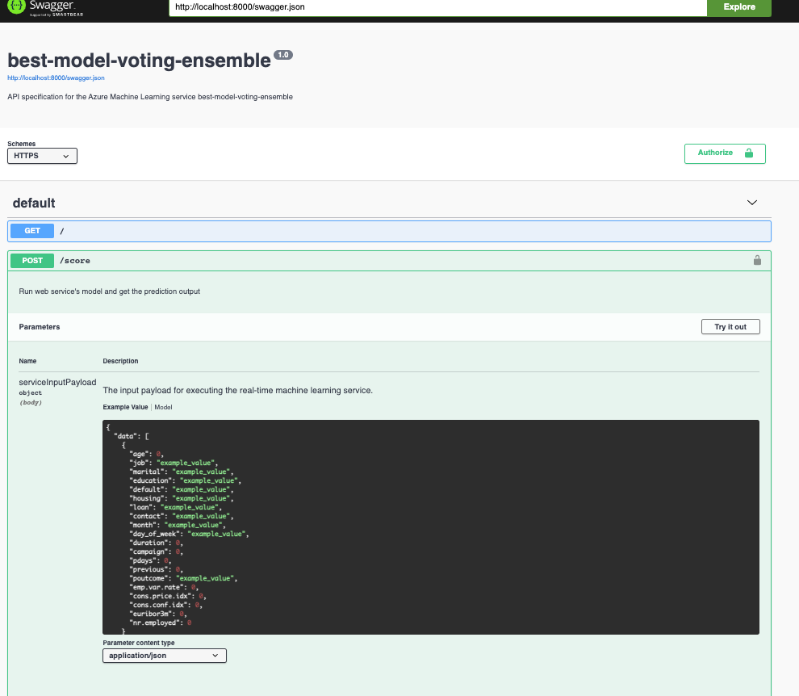  
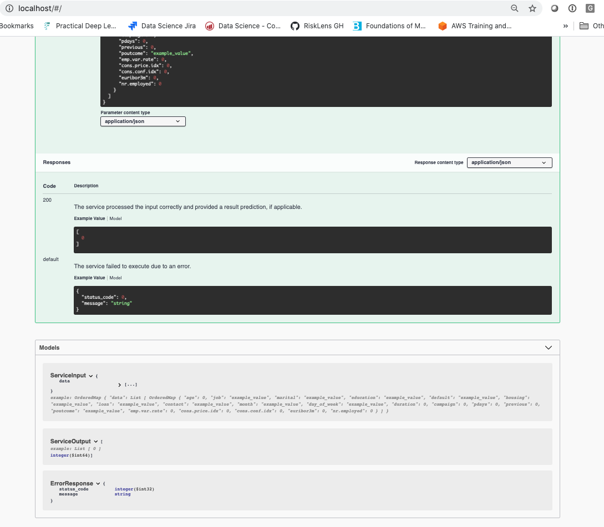  

### Step 6: Consume Model Endpoints

Next, we consumed the model endpoints. First we modified the `endpoint.py` script with the URI and key:  

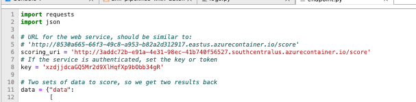  

Then executed the `endpoint.py` script: 

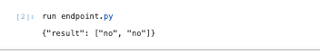 

### Step 7: Create, Publish, and Consume a Pipeline

Next, I modified the `aml-pipelines-with-automated-machine-learning-step.ipynb` Jupyter Notebook (see repo) with variables that matched my environment, uploaded the config.json file to the Azure environment, and ran the cells to create a Pipeline in Azure ML Studio. Various screenshots from the process are below:

Pipeline section of ML Studio, showing pipeline has been created: 

Pipeline endpoint: 

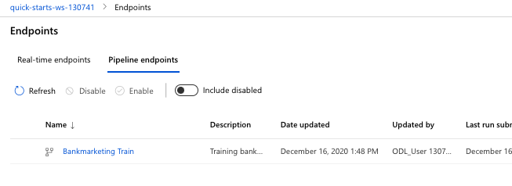

Bankmarketing data set in pipeline: 

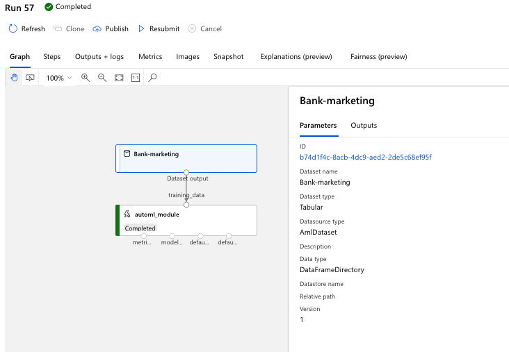

Published pipeline overview: 

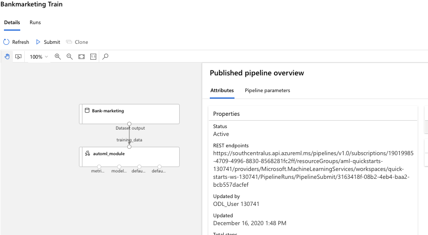

RunDetailsWidget: 

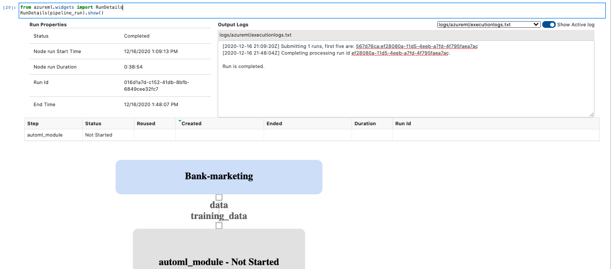

Scheduled run of pipeline via endpoint: 

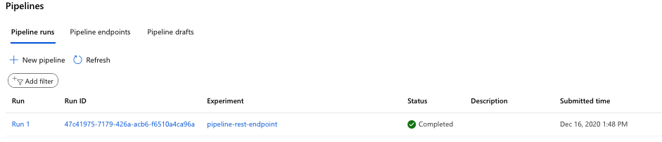

## Screen Recording

My 4-minute screencast walking through this project may be found at: https://youtu.be/i0yuUdNmfK4 

## Opportunities for Improvement

There are a few ways we could improve this project:  

* I could have set up my own Azure account in order to learn how to do authentication.  
* For the AutoML portion, I could have chosen a different metric besides "Accuracy." This is an imbalanced dataset, so using a different metric -- such as AUC -- could have been appropriate.  
* Regarding the imbalanced data set, I could have created a balanced data set to build a stronger model.  
* We could have also done some comparisons to the baseline imbalanced target rate.  
* Perhaps I could have spent some time doing some feature engineering on the Banking data set. I just used it "as is" without trying to do anything to improve the data before it was modeled. 
* We could have enabled deep learning to see if we got a more accurate model from that (no guarantees). 
* Perhaps we could have done some HyperDrive work with one of the best models.  
* We deployed the "best model" from an accuracy perspective. Perhaps, however, we need to use a more "explainable" model, especially since it seems we are making loan decisions. Choosing a simpler, not ensemble, model, may give us the power to do so.  
* It would be good to try to consume the model endpoints with more than just the two given points of data as the JSON paylod, both of which resulted in "no" decisions.  
* From the project assignment perspective, I'll admit I didn't learn a lot about the pipeline process. As feedback for the project creators, leaving more of the pipeline cells as "TODO" for the students would be a good thing from a teaching/learning perspective.  
* I am also quite an amateur when it comes to doing screencasts. An improvement I could undertake is to practice this skill more :).